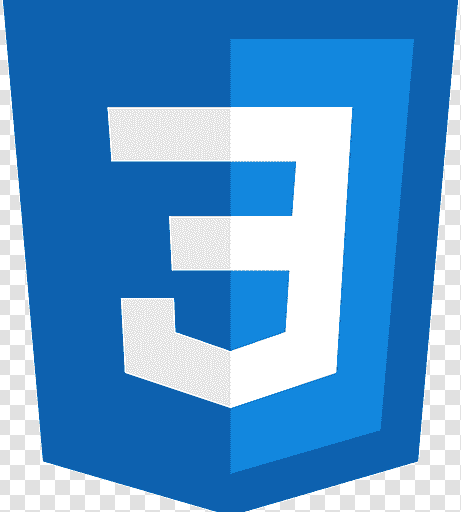
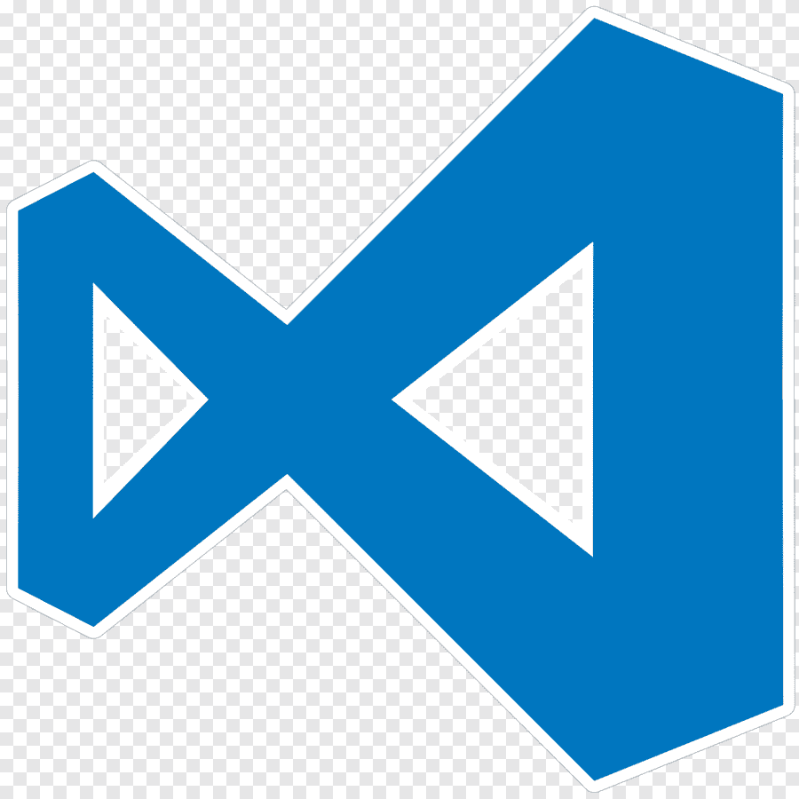
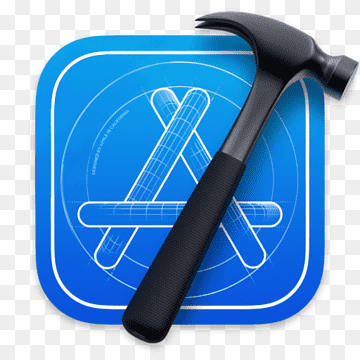

<h1>Hello , I'm Sanjusha</h1>

My coding journey began in 2015 with humble “hello worlds” and curious experiments. Fast forward to today — I’m a Software Engineer at a bank, crafting real-world solutions and still learning something new every day. The ride’s been exciting, and I’m just getting started!

When I’m not knee-deep in code, you’ll find me crocheting cozy creations, getting paint on everything except the canvas, or planning my next adventure thanks to a recent case of the travel bug. Life’s all about balance, and I like to mix logic with a little bit of color and curiosity.

<!--Skills section-->
<h2>Skills </h2>
<h3>Languages</h3>

 `JAVASCRIPT`
 `PYTHON`
 `HTML`
 `CSS`
 `R`

<h3>UI Frameworks/Tools</h3>

 `BOOTSTRAP`

<h3>Databases</h3>

 `MYSQL`

<h3>Tools</h3>

 `GIT`
 `GITHUB`
 `DOCKER`
 `CONDA`

<h3>IDEs/Text Editors</h3>

 `VISUAL STUDIO CODE`
 `XCODE`

<h3>Workspace</h3>

 `MAC OS`
<!--Work & Education section-->
<h2>Work & Education </h2>
<ul>
    <li><strong>Nanyang Technological University (NTU):</strong></li>
    <ul>
        <li>Bachelors of Engineering (Computer Science)</li>
        <ul>
        <li>Aug 2015 - Jun 2019</li>
        </ul>
    </ul>
    <li><strong>DBS Bank Ltd:</strong></li>
    <ul>
        <li>DevOps Engineer • Data Engineer • Software Engineer</li>
        <ul>
        <li>Aug 2019 - Present</li>
        </ul>
    </ul>      
    <li><strong>Starhub:</strong></li>
    <ul>
        <li>Data Analyst • Intern</li>
        <ul>
        <li>Jan 2018 - Jun 2018</li>
        </ul>
    </ul>
</ul>
<!--Interests section-->
<h2>Interests </h2>
<ul>
    <li>Web Design </li>
    <li>Crochet </li>
    <li>Painting </li>
    <li>Scrolling through pinterest</li>
    <li>Travel </li>
</ul>

   
  

    If you have any queries or just wanna say hi,  <b>MAIL ME</b>&nbsp;
  
   <b>OR PING ME</b>&nbsp;
  
  
  

  

